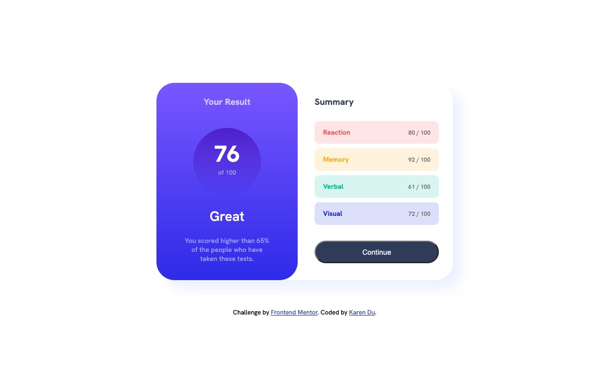

# Frontend Mentor - Results summary component solution

This is a solution to the [Results summary component challenge on Frontend Mentor](https://www.frontendmentor.io/challenges/results-summary-component-CE_K6s0maV). Frontend Mentor challenges help you improve your coding skills by building realistic projects. 

## Table of contents

- [Overview](#overview)
  - [The challenge](#the-challenge)
  - [Screenshot](#screenshot)
  - [Links](#links)
- [My process](#my-process)
  - [Built with](#built-with)
  - [What I learned](#what-i-learned)
  - [Continued development](#continued-development)
  - [Useful resources](#useful-resources)
- [Author](#author)

## Overview

### The challenge

Users should be able to:

- View the optimal layout for the interface depending on their device's screen size
- See hover and focus states for all interactive elements on the page
- **Bonus**: Use the local JSON data to dynamically populate the content

### Screenshot



### Links

- Solution URL: (https://github.com/piecanoe/fm_results-summary-component.git)
- Live Site URL: (fm-results-kd.netlify.app)

## My process

### Built with

- Semantic HTML5 markup
- CSS custom properties
- Flexbox
- CSS Grid
- Google Fonts
- Mobile-first workflow
- Font-Awesome Icons
- Media Queries for Responsiveness

### What I learned

In this exercise, I learned how to make a website responsive using media-queries at the bottom of my CSS file:

```css
@media (max-width: 412px){
}
```
It also took me a long time to figure out how to center the box without needing to scroll the page. I just needed to add "min-height: 100vh" to my body element:

```css
body{
    min-height: 100vh;
}
```

### Continued development

I'd like to grow my skills in building responsive webpages that work for all devices including desktop, mobile, tablet, etc.

### Useful resources

- [Flexbox Guide](https://css-tricks.com/snippets/css/a-guide-to-flexbox/) - Best flexbox cheat sheet online
- [Stack Overflow Thread on Centering Divs](https://stackoverflow.com/questions/52485824/how-to-make-a-div-max-height-equal-to-the-screen-height#:~:text=You%20can%20set%20max%2Dheight,100%25%20of%20the%20viewport's%20height.&text=Also%20note%20that%20max%2Dheight,use%20height%20or%20min%2Dheight%20.) - After painstakingly searching for solutions for hours, this was the solution that worked for me.

## Author

- Website - [Karen Du](https://karendu.netlify.app/)
- GitHub - [@piecanoe](@piecanoe)
- Frontend Mentor - [@piecanoe](https://www.frontendmentor.io/profile/piecanoe)
